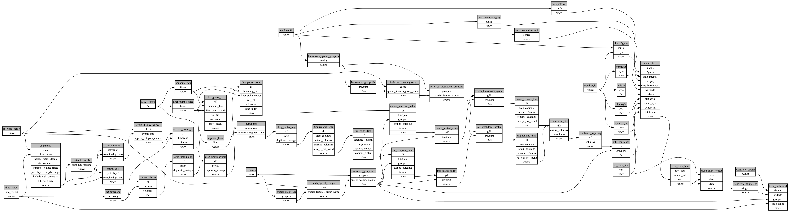

```
# AUTOGENERATED BY ECOSCOPE-WORKFLOWS; see fingerprint in README.md for details

```

```yaml
# fingerprint:
artifacts_sha256_basic: cc5ab4be026ebace3d88b2e770756a5b91f776066655707ddcee3556e79fddae
artifacts_sha256_strict: 9b1c4a42e3b63930b3e1592acb5363870ae5420716391c0122d031fa7192629b
installed_requirements:
- channel: https://repo.prefix.dev/ecoscope-workflows/
  name: ecoscope-platform
  version: {version: ==2.18.4}
- channel: conda-forge
  name: pydeck
  version: {version: ==0.9.2}
params_sha256: eae268e1056d6e8fe73a3a8db7957f1e00e8a940004ddf73ee1063cd30247fdd
spec_sha256: 9d41466d84fea3ede7d55a32d150b5fa3d75d04034d6c8f18d9b9ae6dc56028d

```

# ecoscope-workflows-patrol-chart-workflow


