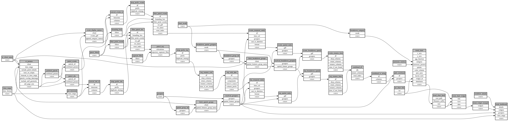

```
# AUTOGENERATED BY ECOSCOPE-WORKFLOWS; see fingerprint in README.md for details

```

```yaml
# fingerprint:
artifacts_sha256_basic: cb4a778c2dfc2674d5f4cf0859baa7060c7f05940e2c5d9a73ab2109c5624e80
artifacts_sha256_strict: 93045b46a59e2250fe01e4726d90ce8b23fda92af8fe02e15e98826135b01d1c
installed_requirements:
- channel: conda-forge
  name: python
  version: {version: ==3.12.13}
- channel: https://repo.prefix.dev/ecoscope-workflows/
  name: lonboard
  version: {version: ==0.0.8}
- channel: conda-forge
  name: numpy
  version: {version: ==2.0.2}
- channel: conda-forge
  name: pyarrow
  version: {version: ==23.0.1}
- channel: conda-forge
  name: rasterio
  version: {version: ==1.4.4}
- channel: conda-forge
  name: pydeck
  version: {version: ==0.9.2}
params_sha256: adbc5380078b82c0c231d78bb7d494e94cfb501298e2e5dfb294aba9ab979f57
spec_sha256: 2f11df3a770c72c62c1ef24cab3a89e11362ab3075283a35428c6efc4f593dd6

```

# ecoscope-workflows-patrol-trend-plot-workflow


